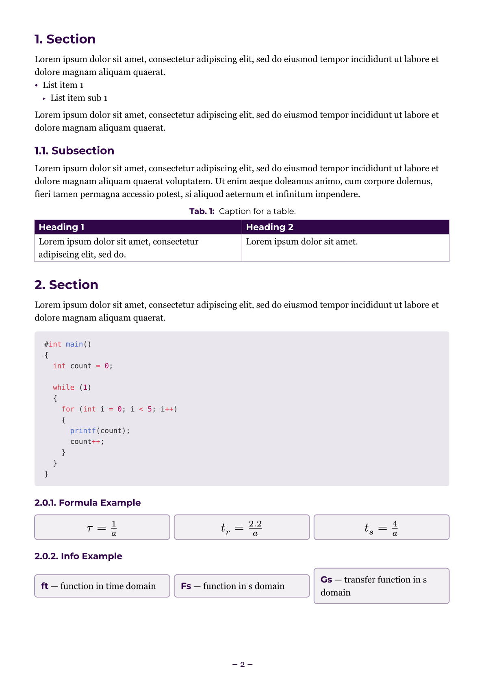

# breezy-stripped

A simplified version of the breezy-report template. A clean, colour-customisable template for note organisation for Typst. Features additional `info-grid` function, `bb` and `bi` functions for easy accenting of text.

## Usage

```typst
#import "@local/breezy-stripped:0.1.0": breezy, info-grid, bi,bb

#show: breezy.with(
  accent: rgb("#300649") //Customise the accent colour
)

//Your content goes here

//Using the info-grid for formulas
#let formulas-1st = (
  (formula: $tau = frac(1, a)$),
  (formula: $t_r = frac(2.2, a)$),
  (formula: $t_s = frac(4,a)$)
)
#info-grid(formulas-1st)

//Using the info-grid to list terms & their definitions
#let terms = (
  (sym: "ft", desc: "function in time domain"),
  (sym: "Fs", desc: "function in s domain"),
  (sym: "Gs", desc: "transfer function in s domain"),
)
#info-grid(terms)
```

## Parameters

| Parameter | Default | Description |
|---|---|---|
| `accent-colour` | `rgb("#300649")` | Primary accent colour |
| `table-header-text-colour` | `white` | Table header text colour |

## Default fonts
 - **Georgia**: Body text.
 - **Montserrat**: Headings and title page. Must be installed locally - download from [Google Fonts](https://fonts.google.com/specimen/Montserrat).
 - **Arial**: Fallback font for headings & title page if Montserrat is not installed.

## Example pages
